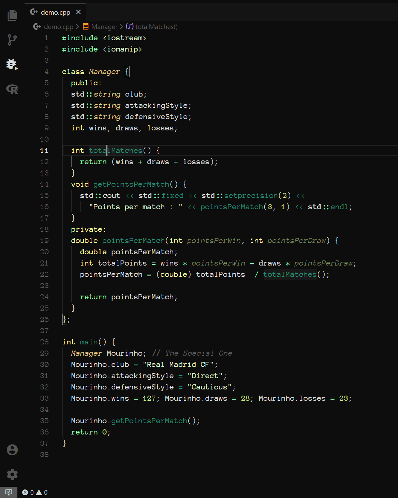

Menelik was designed with simplicity in mind. The theme combines a greyscale-styled base with complementary syntax colours to achieve a simple, clean visual appearance.

The creation of this theme was powered by Mike Tromba's [Theme Studio for VS Code](https://themes.vscode.one/). Check out Mike [here](https://vscode.one/).

Syntax highlighting roughly follows the [Dracula Syntax Highlighting Specification](https://spec.draculatheme.com/). RECheck out the amazing Dracula theme [here](https://draculatheme.com/).

Personal customisation can be done with the ***workbench.colorCustomizations*** and ***editor.tokenColorCustomizations*** user settings. More information on modifying colour themes can be found on [Visual Studio Code's documentation page on themes](https://code.visualstudio.com/docs/getstarted/themes).
